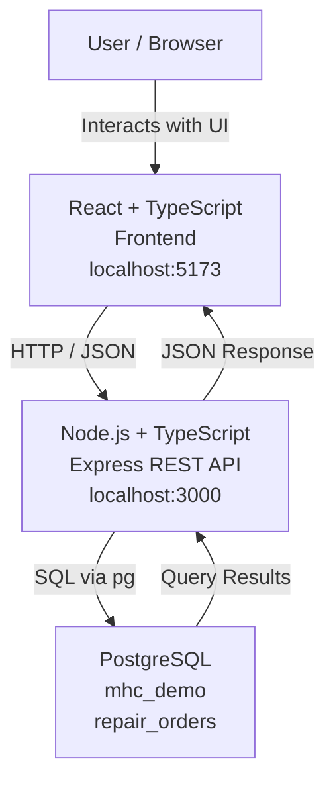
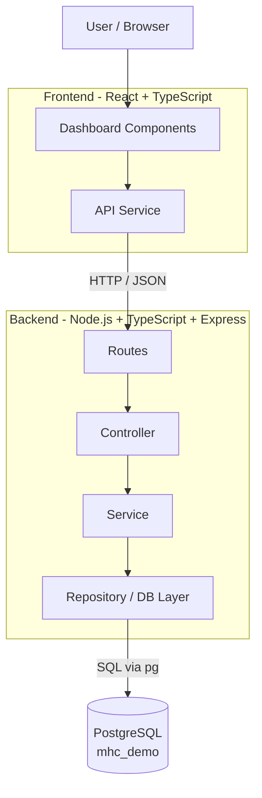

I'm just using this project to brush up on Node.js/typescript and architecture of API design with said languages before I start my new position. 

Frontend
────────────
React
Vite
TypeScript

Backend
────────────
Node.js
Express
TypeScript
tsx

Database
────────────
PostgreSQL

CREATE TABLE repair_orders (
    id SERIAL PRIMARY KEY,
    customer_name VARCHAR(100) NOT NULL,
    technician_name VARCHAR(100),
    status VARCHAR(50) NOT NULL,
    priority VARCHAR(20) NOT NULL,
    description TEXT,
    created_at TIMESTAMP DEFAULT CURRENT_TIMESTAMP
);

Supporting
────────────
Git
dotenv
CORS
pg

Testing
────────────
Vitest
Supertest

Deployment
────────────
Azure

CI/CD
────────────
GitHub Actions

This stack is pretty similar to what I'll experience at MHC giving me some practical knowledge and ideas of the system before I start my new position. 

┌─────────────────────────────┐
│         User / Browser      │
└──────────────┬──────────────┘
               │
               │ HTTP
               ▼
┌─────────────────────────────┐
│      React + TypeScript     │
│          Frontend           │
│                             │
│      localhost:5173         │
└──────────────┬──────────────┘
               │
               │ REST / JSON
               ▼
┌─────────────────────────────┐
│    Node.js + TypeScript     │
│       Express Backend       │
│                             │
│      localhost:3000         │
└──────────────┬──────────────┘
               │
               │ SQL via pg
               ▼
┌─────────────────────────────┐
│         PostgreSQL          │
│                             │
│       mhc_demo database     │
│                             │
│      repair_orders table    │
└─────────────────────────────┘

## Architecture

Goal: 
